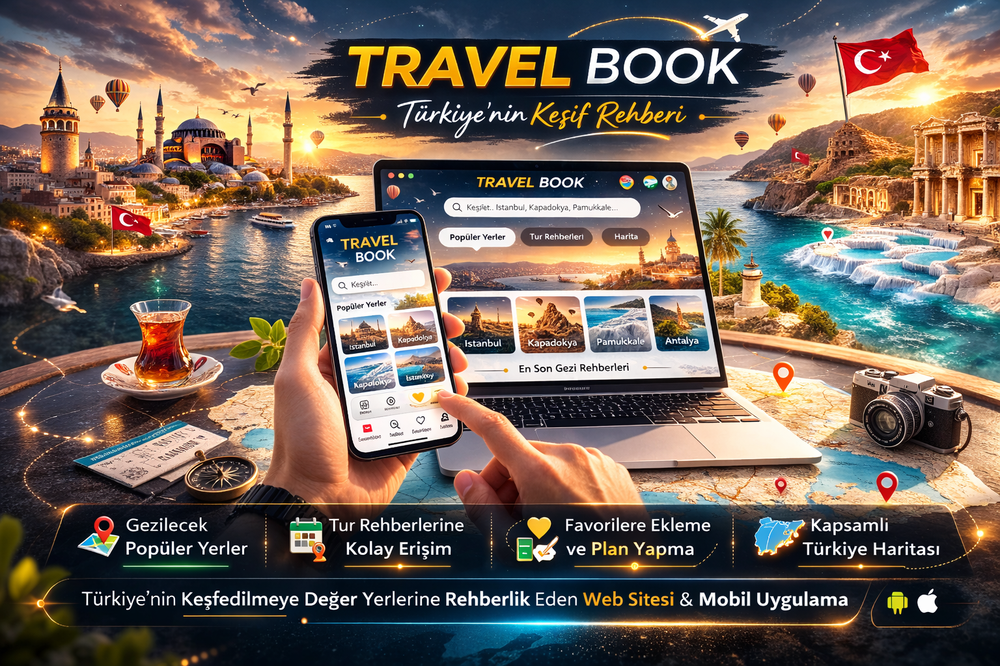

# PROJE ADI

> Travel Book

---

## Proje Hakkında

**Proje Tanımı:** 
> **Travel Book**, Türkiye’nin tarihi, kültürel ve doğal zenginliklerini dijital bir platform üzerinden kullanıcılarla buluşturmayı amaçlayan kapsamlı bir web ve mobil uygulama projesidir. Platform; bireysel gezginlerin gezilecek yerleri keşfetmesini, detaylı tur bilgilerine ulaşmasını, tur rehberleri ve firmalarla etkileşime geçmesini ve seyahat planlarını kolayca oluşturmasını sağlayan entegre bir sistem sunmaktadır.
>
> Kullanıcılar şehir, kategori veya popülerlik bazlı arama ve filtreleme yapabilir, tur detaylarını inceleyebilir, favori listeleri oluşturabilir, satın alma işlemleri gerçekleştirebilir ve deneyimlerini yorumlayarak diğer kullanıcılara katkı sağlayabilir.
>
> Sistem, farklı kullanıcı rollerine yönelik yetkilendirilmiş bir yapı sunmaktadır. Tur firmaları tur oluşturma, güncelleme ve silme işlemlerini gerçekleştirebilirken; tur rehberleri kendi profillerini ve rehberlik yaptıkları turları yönetebilmektedir.
>
> Travel Book, modern arayüz tasarımı, kullanıcı dostu deneyimi ve rol bazlı yönetim yapısı sayesinde Türkiye turizmini dijital ortamda daha erişilebilir, planlanabilir ve etkileşimli hale getirmeyi hedefleyen bütünleşik bir keşif ve seyahat yönetim platformudur.

**Proje Kategorisi:** 
> Dijital Seyahat ve Keşif Platformu

**Referans Uygulama:** 
> [GetYourGuide](https://www.getyourguide.com/tr-tr/)

---

## Proje Linkleri

- **REST API Adresi:**
- **Web Frontend Adresi:** 

---

## Proje Ekibi

**Grup Adı:** 
> CodeLegends

**Ekip Üyeleri:** 
- Furkan Fatih Şahin 
- Recep Arslan
- Beyza Keklikoğlu
- Ümmü Fidan

## Dokümantasyon

Proje dokümantasyonuna aşağıdaki linklerden erişebilirsiniz:

1. [Gereksinim Analizi](Gereksinim-Analizi.md)
2. [REST API Tasarımı](API-Tasarimi.md)
3. [REST API](Rest-API.md)
4. [Web Front-End](WebFrontEnd.md)
5. [Mobil Front-End](MobilFrontEnd.md)
6. [Mobil Backend](MobilBackEnd.md)
7. [Video Sunum](Sunum.md)

---

